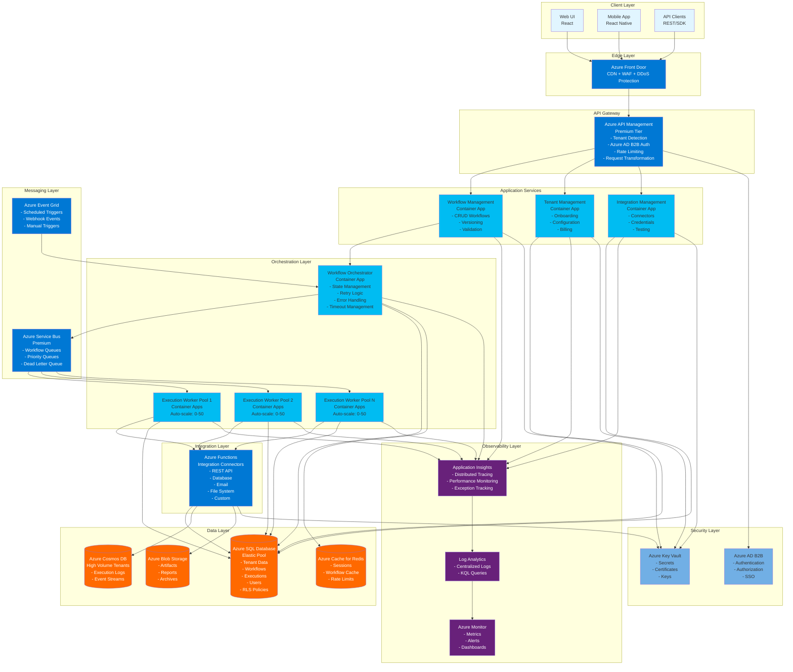
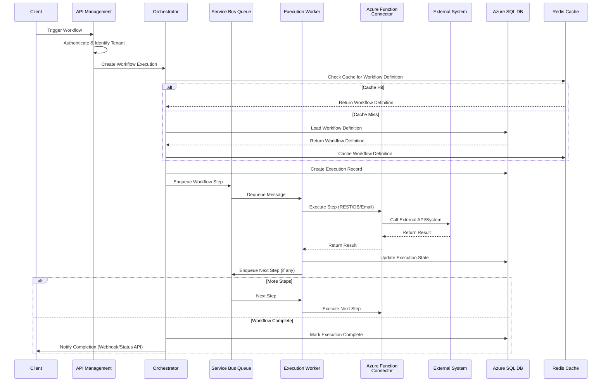
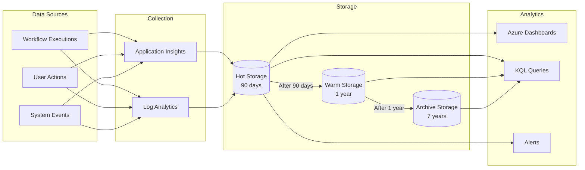

# AutomateIQ 2.0: Visual Architecture Diagram

## Recommended Tools for Creating Architecture Diagrams

### 1. **Draw.io / diagrams.net** (⭐ Recommended - Free)
- **Website**: https://app.diagrams.net/ or https://www.diagrams.net/
- **Why**: Free, web-based, has Azure icon library, exports to PNG/SVG/PDF
- **Best for**: Professional diagrams with Azure icons
- **How to use**: 
  1. Go to app.diagrams.net
  2. Choose "Create New Diagram" → "Azure" template
  3. Drag and drop Azure icons
  4. Export as PNG/PDF for presentations

### 2. **Lucidchart** (Professional - Paid)
- **Website**: https://www.lucidchart.com/
- **Why**: Professional, has Azure architecture templates, collaboration features
- **Best for**: Team collaboration and professional presentations
- **Cost**: Free trial, then ~$10-20/month

### 3. **Miro** (Collaborative Whiteboard)
- **Website**: https://miro.com/
- **Why**: Great for brainstorming, has Azure templates, real-time collaboration
- **Best for**: Collaborative design sessions
- **Cost**: Free tier available, paid plans for teams

### 4. **Microsoft Visio** (Enterprise)
- **Why**: Official Microsoft tool, excellent Azure integration
- **Best for**: Enterprise environments already using Microsoft tools
- **Cost**: Part of Microsoft 365 subscription

### 5. **Mermaid** (Code-based - Free)
- **Why**: Write diagrams as code, renders in GitHub/Markdown
- **Best for**: Version-controlled diagrams, documentation
- **See below for Mermaid diagram**

---

## Mermaid Architecture Diagram

You can render this directly in GitHub, GitLab, or any Mermaid-compatible viewer:

---

## Workflow Execution Flow Diagram

---

## Data Flow Diagram

---

## How to Use These Diagrams

### Option 1: Draw.io (Recommended for Presentations)
1. Go to https://app.diagrams.net/
2. File → New → Choose "Azure" template
3. Use Azure icon library (More Shapes → Azure)
4. Create your diagram
5. Export as PNG (high resolution) or PDF

### Option 2: Mermaid (For Documentation)
- The Mermaid diagrams above will render automatically in:
  - GitHub/GitLab markdown files
  - VS Code with Mermaid extension
  - Online at https://mermaid.live/
- To export as image: Use https://mermaid.live/ → Export as PNG/SVG

### Option 3: Lucidchart (Professional)
1. Sign up at https://www.lucidchart.com/
2. Create new diagram → Choose "Azure Architecture" template
3. Drag Azure icons from the library
4. Export as PNG/PDF

### Option 4: Use Mermaid Live Editor
1. Go to https://mermaid.live/
2. Copy the Mermaid code from above
3. Paste and render
4. Export as PNG/SVG

---

## Quick Start: Draw.io Azure Architecture

**Step-by-step for Draw.io:**

1. **Open Draw.io**: https://app.diagrams.net/
2. **Choose Template**: File → New → Azure → Azure Architecture
3. **Add Components**:
   - Search for "Azure Front Door" in shapes
   - Search for "API Management"
   - Search for "Container Apps"
   - Search for "SQL Database"
   - Search for "Service Bus"
   - Search for "Functions"
   - Search for "Redis"
   - Search for "Blob Storage"
   - Search for "Application Insights"
   - Search for "Key Vault"
   - Search for "Active Directory"

4. **Arrange Layers**:
   - Top: Clients (Web UI, Mobile, API)
   - Second: Front Door
   - Third: API Management
   - Fourth: Application Services (3 boxes)
   - Fifth: Orchestrator
   - Sixth: Workers (3 boxes)
   - Seventh: Messaging (Service Bus, Event Grid)
   - Eighth: Data Layer (SQL, Cosmos, Blob, Redis)
   - Bottom: Observability & Security

5. **Connect Components**: Use arrows to show data flow
6. **Export**: File → Export as → PNG (300 DPI for presentations)

---

## Tips for Professional Diagrams

1. **Use Consistent Colors**:
   - Azure Blue (#0078d4) for Azure services
   - Light Blue (#e1f5ff) for client applications
   - Orange (#ff6900) for data storage
   - Purple (#68217a) for monitoring

2. **Group Related Components**: Use containers/boxes to group layers

3. **Label Connections**: Add labels to arrows showing data flow direction

4. **Keep It Simple**: Don't overcrowd - use multiple diagrams if needed

5. **Add Legends**: Include a legend explaining colors/symbols

6. **High Resolution**: Export at 300 DPI for presentations

---

## Example: Draw.io File Structure

If you create in Draw.io, save as `.drawio` file and you can:
- Version control it (it's XML)
- Edit anytime
- Export to multiple formats
- Share with team

**Recommended file**: `AutomateIQ_Architecture.drawio`

